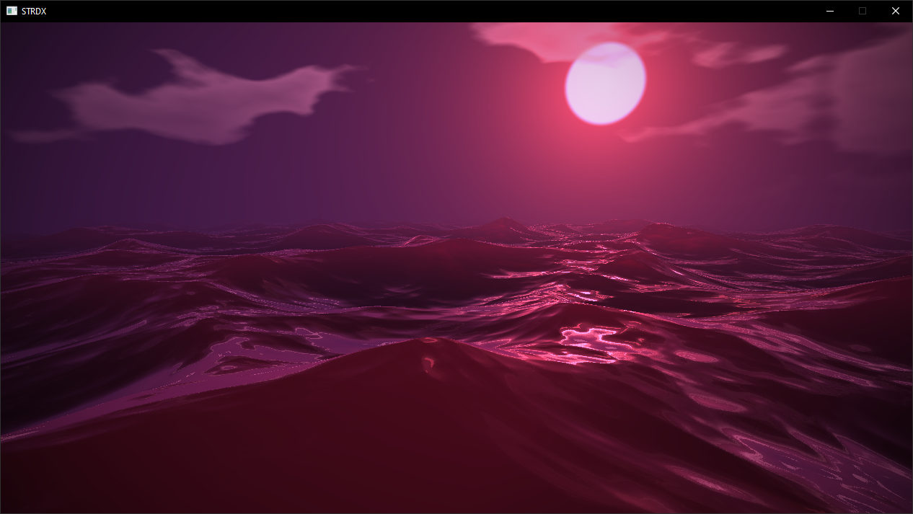

# STRDX

Simple DirectX 11. Add new context implementation without modify main code base.
## C++ API
```cpp
void Start()
{
    // create context
    context->Create(R_DX11, GetWidth(), GetHeight());

    // set viewport
    context->SetViewport(GetWidth(), GetHeight());

    // set primitive topology
    context->SetPrimitiveTopology(PT_TRIANGLELIST);

    // create shader
    shader = Shader::Create(R_DX11);

    // load shaders
    shader->LoadVertex("vertex.bin", false);
    shader->LoadPixel("pixel.bin", false);

    // compile shaders
    //shader->CompileVertex();
    //shader->CompilePixel();

    // save shaders
    //shader->SaveVertex("vertex.bin");
    //shader->SavePixel("pixel.bin");

    // create shaders
    shader->CreateVertex();
    shader->CreatePixel();

    shader->AddLayout("POSITION", 0, 3);
    //shader->AddLayout("COLOR", 0, 4, 0, 12);
    shader->CreateLayout();

    // x, y, z coords
    vertices.push_back(Vertex(-1.0f, -1.0f, 0.0f));
    vertices.push_back(Vertex(-1.0f, 1.0f, 0.0f));
    vertices.push_back(Vertex(1.0f, 1.0f, 0.0f));
    vertices.push_back(Vertex(1.0f, -1.0f, 0.0f));
    //vertices.push_back(Vertex(1.0f, -1.0f, 0.0f, 1.0f, 0.0f, 0.0f, 1.0f));

    shader->AddIndex(0);
    shader->AddIndex(1);
    shader->AddIndex(2);
    shader->AddIndex(0);
    shader->AddIndex(2);
    shader->AddIndex(3);

    shader->CreateVertexBuffer<Vertex>(vertices);
    //shader->CreateVertexBuffer<Vertex>(vertices, true);
    shader->CreateIndexBuffer();
    //shader->CreateIndexBuffer(true);
    shader->CreateConstantBuffer<ConstantBuffer>();
}

void Render()
{
    if (shader)
    {
        shader->Set<Vertex>();

        cb.SetTime(GetTime());
        cb.SetResolution(GetWidth(), GetHeight());
        shader->UpdateConstantBuffer<ConstantBuffer>(cb);

        //vertices.push_back(Vertex(-1.0f, -1.0f, 0.0f));
        //vertices.push_back(Vertex(-1.0f, 1.0f, 0.0f));
        //vertices.push_back(Vertex(1.0f, 1.0f, 0.0f));
        //vertices.push_back(Vertex(1.0f, -1.0f, 0.0f));
        //shader->UpdateVertexBuffer<Vertex>(vertices);

        //shader->AddIndex(0);
        //shader->AddIndex(1);
        //shader->AddIndex(2);
        //shader->AddIndex(0);
        //shader->AddIndex(2);
        //shader->AddIndex(3);
        //shader->UpdateIndexBuffer();

        //shader->ReleaseVertex();
        //shader->LoadVertex("data\\shaders\\vertex.bin", false);
        //shader->CreateVertex();

        //shader->ReleasePixel();
        //shader->LoadPixel("data\\shaders\\pixel.bin", false);
        //shader->CreatePixel();
        //shader->ReleasePixelBlob();

        //shader->ReleaseLayout();
        //shader->AddLayout("POSITION", 0, 3);
        //shader->CreateLayout();
        //shader->ReleaseVertexBlob();

        shader->Draw();
        //shader->Draw(1);
    }
}

void Release()
{
    if (shader) shader->Release();
}
```
## Build
- Visual Studio 2022
- Platform Toolset: v143
- C++ Language Standard: C++ 2014
- Configuration: Debug or Release
- Platform: x64
## Credits
https://shadered.org/ \
https://www.shadertoy.com/view/NlKGWK
## License
STRDX is licensed under the Apache 2.0 License, see [LICENSE](/LICENSE) for more information.
