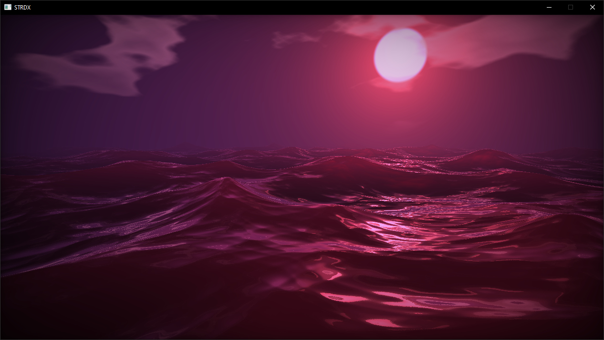

# STRDX

Simple DirectX 11. Add new context implementation without modify main code base.
## C++ API
```cpp
void Start()
{
    // create context
    context->Create(R_DX11, window->GetClientWidth(), window->GetClientHeight());

    // set viewport
    context->SetViewport(window->GetClientWidth(), window->GetClientHeight());

    // set primitive topology
    context->SetPrimitiveTopology(PT_TRIANGLELIST);

    // create shader
    shader = Shader::Create(R_DX11);
    shader->LoadVertex("vertex.bin", false);
    shader->LoadPixel("pixel.bin", false);

    shader->CreateVertex();
    shader->CreatePixel();

    shader->AddLayout("POSITION", 0, 3, 0, 0); // format
    //shader->AddLayout("COLOR", 0, 4, 0, 12); // format, offset
    shader->CreateLayout();

    // x, y, z coords
    vertices.push_back(Vertex(-1.0f, -1.0f, 0.0f));
    vertices.push_back(Vertex(-1.0f, 1.0f, 0.0f));
    vertices.push_back(Vertex(1.0f, 1.0f, 0.0f));
    vertices.push_back(Vertex(1.0f, -1.0f, 0.0f));

    shader->AddIndex(0);
    shader->AddIndex(1);
    shader->AddIndex(2);
    shader->AddIndex(0);
    shader->AddIndex(2);
    shader->AddIndex(3);

    shader->CreateVertexBuffer<Vertex>(vertices);
    shader->CreateIndexBuffer();
    shader->CreateConstantBuffer<ConstantBuffer>();
}

void Render()
{
    if (shader)
    {
        shader->Set<Vertex>();
        shader->UpdateConstantBuffer<ConstantBuffer>(cb);
        shader->Draw(4, 6);
    }
}

void Release()
{
    if (shader) shader->Release();
}
```
## Build
- Visual Studio 2022
- Platform Toolset: v143
- Configuration: Debug or Release
- Platform: x64
## Credits
https://shadered.org/ \
https://www.shadertoy.com/view/NlKGWK
## License
STRDX is licensed under the Apache 2.0 License, see [LICENSE](/LICENSE) for more information.
